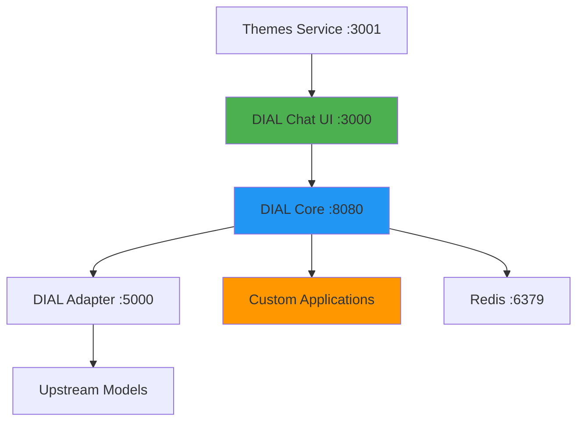
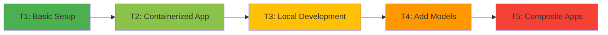

# DIAL Local Setup - Documentation

> **AI DIAL (AI Distributed Application Layer)** local learning environment - A Docker-based platform for building and orchestrating AI models and applications through a unified gateway.

## Table of Contents
- [What is DIAL Local Setup?](#what-is-dial-local-setup)
- [Quick Start](#quick-start)
- [Documentation Structure](#documentation-structure)
- [Learning Path](#learning-path)
- [Key Features](#key-features)
- [Getting Help](#getting-help)

## What is DIAL Local Setup?

DIAL Local Setup is a **hands-on learning environment** designed to teach developers how to:
- Build AI applications using the DIAL SDK
- Configure and orchestrate AI models through DIAL Core
- Develop applications locally with hot-reload workflows
- Integrate upstream LLM providers (OpenAI, Anthropic, Google)
- Create composite AI applications that leverage multiple models

### Core Components



**Services:**
- **DIAL Chat** (port 3000) - Web-based chat interface
- **DIAL Core** (port 8080) - API gateway and request router
- **DIAL Adapter** (port 5000) - Upstream model communication
- **Redis** (port 6379) - Session and cache storage
- **Themes** (port 3001) - UI theme assets

**Custom Applications:**
- **Echo** (ports 5000/5022) - Simple message repeater for testing
- **Essay Assistant** (port 5025) - Essay-focused AI assistant using AsyncDial

## Quick Start

### Prerequisites
- Docker & Docker Compose
- Python 3.11+ (for local development)
- 8GB RAM minimum
- DIAL API key (for upstream models)

### 5-Minute Setup

```bash
# 1. Clone and enter directory
cd ai-dial-dial-local-setup

# 2. Start core services
docker compose up -d

# 3. Verify services are running
docker compose ps -a

# 4. Open DIAL Chat
open http://localhost:3000
```

🎯 **What you should see:** DIAL Chat interface opens with marketplace view (no models/apps yet - that's normal!)

### Your First Application

```bash
# Navigate to task 3 echo application
cd tasks/t3/echo

# Install dependencies
pip install -r requirements.txt

# Run locally
python app.py
```

Add to `core/config.json`:
```json
{
  "applications": {
    "echo": {
      "displayName": "My Echo App",
      "endpoint": "http://host.docker.internal:5022/openai/deployments/echo/chat/completions"
    }
  }
}
```

Restart Core and test at [http://localhost:3000](http://localhost:3000)

## Documentation Structure

| Document | Purpose | Audience |
|----------|---------|----------|
| **[Architecture](./architecture.md)** | System design, data flows, decisions | Developers, Architects |
| **[Setup Guide](./setup.md)** | Installation, configuration, troubleshooting | All users |
| **[API Reference](./api.md)** | DIAL SDK, endpoints, interfaces | Developers |
| **[Testing Strategy](./testing.md)** | Test patterns, validation | Developers |
| **[Roadmap](./roadmap.md)** | Learning path (T1-T5 tasks) | Learners |
| **[Glossary](./glossary.md)** | Domain terms, abbreviations | All users |
| **[ADR Directory](./adr/)** | Architecture decisions | Architects, Team Leads |
| **[Changelog](./changelog.md)** | Version history | All users |

## Learning Path

This project uses a **progressive task-based curriculum** (T1-T5):



| Task | Focus | Time | Skills |
|------|-------|------|--------|
| **T1** | Basic DIAL setup | 10 min | Docker, DIAL Chat |
| **T2** | First containerized app | 20 min | DIAL SDK, Docker build |
| **T3** | Local dev workflow | 15 min | Hot reload, debugging |
| **T4** | Adding models | 20 min | Adapters, upstreams |
| **T5** | Advanced apps | 30 min | AsyncDial client, streaming |

👉 **Start here:** [Roadmap - Complete Learning Path](./roadmap.md)

## Key Features

### 🔥 Hot Reload Development
Edit Python apps in your IDE, restart the app (no Docker rebuild), see changes instantly.

### 🎯 Configuration-Driven
All models and applications defined in `core/config.json` - no code changes needed to add new AI models.

### 🔒 Secrets Management
Keep API keys out of Git using `core/keys.json` (gitignored) for sensitive upstreams.

### 🚀 Production Patterns
Learn real-world patterns: streaming responses, async clients, error handling, rate limiting.

### 📦 Containerized & Portable
Everything runs in Docker - consistent across Mac, Windows, Linux.

## Getting Help

### Common Issues
- **Port conflicts:** Check ports 3000, 8080, 6379, 5000, 5022, 5025 are available
- **Mac users:** Uncomment `platform: linux/amd64` in docker-compose.yml
- **Config changes:** Require `docker compose stop && docker compose up -d --build`
- **API keys:** Use `dial_api_key` from core/config.json keys section
- **Host access:** Use `host.docker.internal` (not `localhost`) for local apps

### Resources
- **Setup Issues:** See [Setup Guide - Troubleshooting](./setup.md#troubleshooting)
- **Architecture Questions:** See [Architecture Guide](./architecture.md)
- **API Usage:** See [API Reference](./api.md)
- **Task Instructions:** See [Roadmap](./roadmap.md)

### File Locations Quick Reference
```
core/config.json          # Main configuration (models, apps, keys)
core/keys.json           # Secrets (gitignored, create manually)
settings/settings.json   # Core server settings
docker-compose.yml       # Service orchestration
tasks/                   # T1-T5 learning tasks
```

## Next Steps

1. **New to DIAL?** → Start with [Setup Guide](./setup.md)
2. **Understanding the system?** → Read [Architecture](./architecture.md)
3. **Building apps?** → Study [API Reference](./api.md)
4. **Learning mode?** → Follow [Roadmap Tasks](./roadmap.md)

---

**⚠️ Security Reminder:** Never commit API keys to Git. Use `core/keys.json` for sensitive credentials.

**📝 Note:** This is a learning environment. For production deployments, consult official DIAL documentation.
