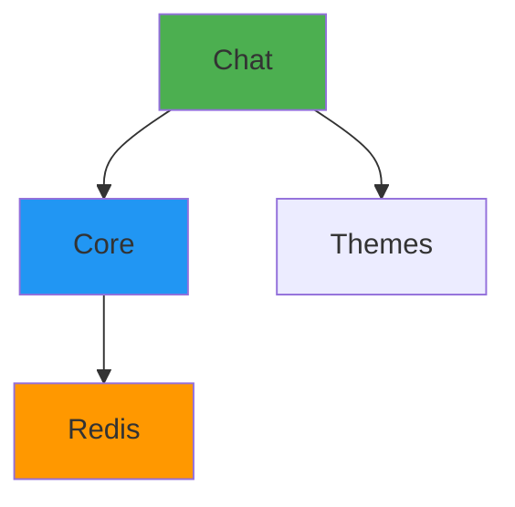

# ADR-004: Docker Compose for Orchestration

**Status:** Accepted

**Date:** 2025-12-30

**Deciders:** Project Architects

## Context

We need to orchestrate multiple services (DIAL Core, Chat UI, Redis, Themes, Adapter) for the local development environment. Options include:
- Manual Docker commands
- Docker Compose
- Kubernetes (k3s, minikube)
- Custom scripts

## Decision

Use **Docker Compose** as the orchestration tool for all containerized services in DIAL Local Setup.

## Rationale

### Why Docker Compose?

**1. Simplicity:**
- Single command to start all services: `docker compose up -d`
- Single configuration file: `docker-compose.yml`
- No cluster management overhead

**2. Learning-Friendly:**
- Widely known tool
- Clear service definitions
- Easy to understand YAML syntax
- Good documentation available

**3. Local Development Focus:**
- Designed for single-machine deployment
- Fast startup/shutdown
- Minimal resource overhead

**4. Networking:**
- Automatic service discovery via service names
- Default bridge network "just works"
- Easy port mappings

**5. Volume Management:**
- Simple volume mounts for config/data
- Persistent storage built-in
- Easy to clean up

### Why Not Alternatives?

**Manual Docker Commands:**
```bash
docker run -d --name core ...
docker run -d --name chat ...
docker run -d --name redis ...
```

**Cons:**
- ❌ Verbose, error-prone
- ❌ Hard to manage dependencies
- ❌ No automatic networking
- ❌ Difficult to document

**Kubernetes:**
```yaml
# Deployments, Services, ConfigMaps, etc.
```

**Cons:**
- ❌ Massive complexity for local dev
- ❌ Requires k8s cluster (minikube, k3s)
- ❌ Higher resource usage
- ❌ Steeper learning curve
- ❌ Overkill for learning environment

**Custom Scripts:**
```bash
#!/bin/bash
./start-redis.sh
./start-core.sh
./start-chat.sh
```

**Cons:**
- ❌ Reinventing the wheel
- ❌ Platform-specific (bash vs PowerShell)
- ❌ Harder to maintain

## Consequences

### Positive

- **Quick Start:** `docker compose up -d` for everything
- **Easy Cleanup:** `docker compose down -v` removes all
- **Service Discovery:** Use service names (http://core:8080)
- **Port Mapping:** Expose only needed ports
- **Logs:** Unified logging (`docker compose logs -f`)
- **Health Checks:** Built-in health check support
- **Extensibility:** Easy to add new services

### Negative

- **Single Machine Only:** Not for distributed deployment
- **Limited Scaling:** Can't auto-scale services
- **No High Availability:** Single point of failure
- **Version Differences:** Compose V1 vs V2 syntax
- **Platform Issues:** Some quirks on macOS ARM

## Implementation

### File Structure

```
docker-compose.yml          # Main compose file (root)
tasks/t2/docker-compose.yml # Extended compose for T2
.env                        # Environment variables (optional)
```

### Main docker-compose.yml

```yaml
services:
  themes:
    image: epam/ai-dial-chat-themes:development
    ports:
      - "3001:8080"
  
  chat:
    image: epam/ai-dial-chat:development
    ports:
      - "3000:3000"
    depends_on:
      - themes
      - core
    environment:
      DIAL_API_HOST: "http://core:8080"
      DIAL_API_KEY: "dial_api_key"
  
  redis:
    image: redis:7.2.4-alpine3.19
    ports:
      - "6379:6379"
    command: >
      redis-server
      --maxmemory 2000mb
      --maxmemory-policy volatile-lfu
  
  core:
    image: epam/ai-dial-core:development
    ports:
      - "8080:8080"
    depends_on:
      - redis
    volumes:
      - ./settings:/opt/settings
      - ./core:/opt/config
      - ./core-logs:/app/log
      - ./core-data:/app/data
    environment:
      'aidial.config.files': '["/opt/config/config.json"]'
      'aidial.redis.singleServerConfig.address': 'redis://redis:6379'
```

### Extended Compose (T2)

```yaml
include:
  - path: ../../docker-compose.yml
    env_file: ./.env

services:
  echo:
    build: echo
```

### Common Commands

**Start services:**
```bash
docker compose up -d
```

**Stop services:**
```bash
docker compose stop
```

**Restart after config change:**
```bash
docker compose stop && docker compose up -d --build
```

**View logs:**
```bash
docker compose logs -f core
```

**Check status:**
```bash
docker compose ps -a
```

**Full cleanup:**
```bash
docker compose down -v --remove-orphans
```

### Volume Mounts

| Service | Mount | Purpose |
|---------|-------|---------|
| core | `./settings:/opt/settings` | Server config |
| core | `./core:/opt/config` | DIAL config |
| core | `./core-logs:/app/log` | Logs |
| core | `./core-data:/app/data` | Conversations/files |

**Why volume mounts?**
- Edit config without rebuilding
- Persist data across restarts
- Easy log access from host

### Service Dependencies



**depends_on ensures:**
- Redis starts before Core
- Core and Themes start before Chat

### Networking

**Default bridge network:**
- All services on same network
- Service name = hostname
- Example: Chat → `http://core:8080`

**Port exposure:**
```yaml
ports:
  - "3000:3000"  # host:container
```

Only these ports accessible from host:
- 3000 (Chat)
- 3001 (Themes)
- 8080 (Core)
- 6379 (Redis)

### Platform-Specific Considerations

**macOS ARM (M1/M2/M3):**
```yaml
services:
  core:
    platform: linux/amd64  # Force x86 emulation
```

**Windows WSL2:**
- Use WSL2 backend in Docker Desktop
- Use forward slashes in paths

**Linux:**
```yaml
services:
  core:
    extra_hosts:
      - "host.docker.internal:host-gateway"
```

## Alternatives Considered

### Alternative 1: Kubernetes (Minikube)

**Pros:**
- Production-like environment
- Better scalability
- Service mesh options

**Cons:**
- ❌ Too complex for learners
- ❌ Requires Kubernetes knowledge
- ❌ Higher resource usage (2-4GB RAM for cluster)
- ❌ Slower startup
- ❌ More configuration needed

**Verdict:** Rejected - overkill for local learning.

### Alternative 2: Docker Swarm

**Pros:**
- Built into Docker
- Simpler than Kubernetes
- Service scaling

**Cons:**
- ❌ Still more complex than Compose
- ❌ Not widely used (declining popularity)
- ❌ Unnecessary for single machine

**Verdict:** Rejected - Compose is simpler and sufficient.

### Alternative 3: Podman + Podman Compose

**Pros:**
- Rootless containers
- Kubernetes YAML compatible

**Cons:**
- ❌ Less common than Docker
- ❌ Compatibility issues
- ❌ Harder to find support
- ❌ Extra installation step

**Verdict:** Rejected - Docker is ubiquitous.

### Alternative 4: Tilt

**Pros:**
- Great for microservices development
- Fast rebuild/reload
- Good UI

**Cons:**
- ❌ Additional tooling
- ❌ Learning curve
- ❌ Overkill for fixed services

**Verdict:** Rejected - Compose + local development is simpler.

## Migration Path

### From Manual Docker to Compose

**Before:**
```bash
docker run -d --name redis redis:7.2.4-alpine3.19
docker run -d --name core -p 8080:8080 epam/ai-dial-core:development
docker run -d --name chat -p 3000:3000 epam/ai-dial-chat:development
```

**After:**
```yaml
# docker-compose.yml
services:
  redis:
    image: redis:7.2.4-alpine3.19
  core:
    image: epam/ai-dial-core:development
    ports:
      - "8080:8080"
  chat:
    image: epam/ai-dial-chat:development
    ports:
      - "3000:3000"
```

```bash
docker compose up -d
```

### To Production (Future)

For production deployment, consider:
- Kubernetes with Helm charts
- Separate config management (ConfigMaps, Secrets)
- External databases (not Redis)
- Load balancers
- Monitoring/logging infrastructure

## Best Practices

**1. Use Specific Image Tags**
```yaml
# ❌ Bad (unpredictable)
image: epam/ai-dial-core:latest

# ✅ Good (reproducible)
image: epam/ai-dial-core:development
```

**2. Define Resource Limits**
```yaml
services:
  redis:
    mem_limit: 2200M
    cpus: 1.0
```

**3. Use Health Checks**
```yaml
services:
  core:
    healthcheck:
      test: ["CMD", "curl", "-f", "http://localhost:8080/health"]
      interval: 30s
      timeout: 10s
      retries: 3
```

**4. Clean Up Regularly**
```bash
docker compose down -v --remove-orphans
docker system prune -a
```

**5. Document Port Usage**
```yaml
# Document in comments
ports:
  - "3000:3000"  # DIAL Chat UI
```

## Related ADRs

- [ADR-002: Local Development](./ADR-002-local-development-host-docker-internal.md) - How local apps connect
- [ADR-001: Configuration-Driven](./ADR-001-configuration-driven-architecture.md) - Config volume mounts

## References

- [Docker Compose Documentation](https://docs.docker.com/compose/)
- [Setup Guide - Installation](../setup.md#installation)
- [Architecture Guide - Deployment](../architecture.md#deployment-architecture)
