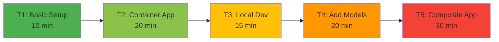
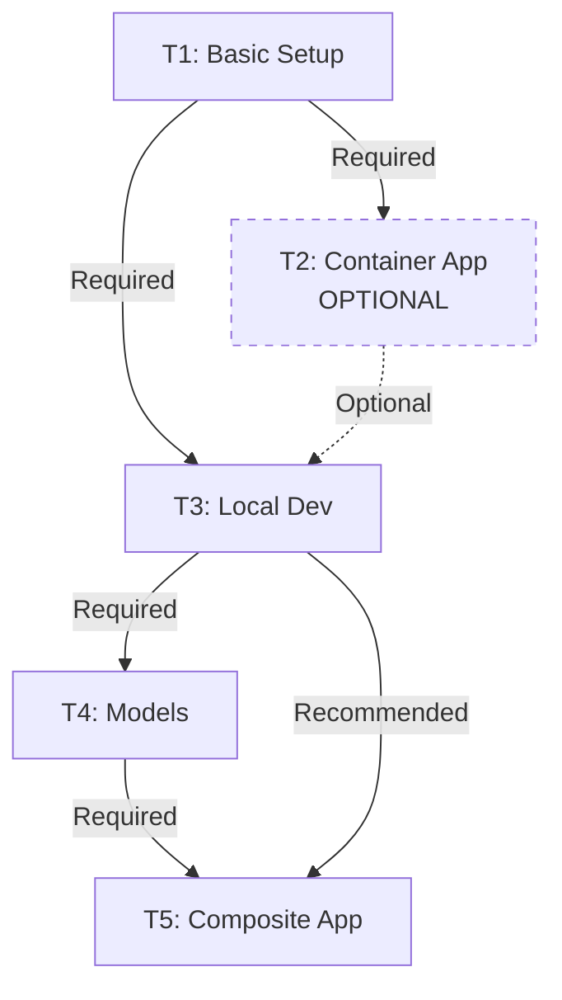

# ADR-005: Task-Based Learning Progression

**Status:** Accepted

**Date:** 2025-12-30

**Deciders:** Project Architects, Learning Design Team

## Context

We need to design a learning path for developers new to DIAL. The environment must balance:
- **Progressive complexity** - Don't overwhelm beginners
- **Practical skills** - Teach real-world patterns
- **Self-paced** - Allow learners to move at own speed
- **Modular** - Tasks can be completed independently

## Decision

Implement a **sequential task-based curriculum (T1-T5)** with increasing complexity and cumulative skills.

## Task Structure



### Task 1: Basic DIAL Setup
**Goal:** Get DIAL Chat running with zero configuration.

**Skills:**
- Docker Compose basics
- Service health checking
- UI navigation

**Deliverable:** Working DIAL Chat (no models/apps)

**Duration:** 10 minutes

---

### Task 2: First Containerized Application (Optional)
**Goal:** Build and deploy Echo app in Docker container.

**Skills:**
- DIAL SDK basics
- Dockerfile creation
- Extended Docker Compose
- Container networking

**Deliverable:** Echo app running in container

**Duration:** 20 minutes

**Why Optional?** T3 teaches better development pattern (local), but T2 shows containerization for completeness.

---

### Task 3: Local Development Workflow
**Goal:** Run Echo app locally with hot-reload capability.

**Skills:**
- host.docker.internal pattern
- Local IDE development
- Configuration management
- Fast iteration workflow

**Deliverable:** Echo app running locally, editable in IDE

**Duration:** 15 minutes

**Key Insight:** "Edit → Restart → Test" is faster than "Edit → Build → Deploy → Test"

---

### Task 4: Integrating Models
**Goal:** Add GPT-4, Claude, Gemini via adapters.

**Skills:**
- Model configuration
- Upstream providers
- Adapter deployment
- Rate limiting
- API key management

**Deliverable:** 3+ working models in Chat UI

**Duration:** 20 minutes

---

### Task 5: Composite Applications
**Goal:** Build Essay Assistant that calls other models.

**Skills:**
- AsyncDial client library
- System prompts
- Streaming responses
- Application composition
- Advanced patterns

**Deliverable:** Essay Assistant using GPT-4

**Duration:** 30 minutes

**Capstone:** Combines all previous concepts.

## Rationale

### Why Sequential Tasks?

**Progressive Disclosure:**
- Start simple (just run it)
- Add one concept per task
- Build on previous knowledge
- Avoid cognitive overload

**Example Progression:**
1. T1: "Docker Compose exists" ✅
2. T2: "I can build Docker images" ✅
3. T3: "Local development is faster" ✅
4. T4: "I can add models" ✅
5. T5: "I can build complex apps" ✅

### Why This Order?

**T1 First:** Immediate gratification (something works!)

**T2 Optional:** Shows containerization but not required for learning

**T3 Before T4:** Establish development workflow before adding complexity

**T4 Before T5:** Understand models before composing them

**T5 Last:** Requires all previous concepts

### Why Estimated Durations?

- Set expectations
- Identify struggling learners
- Improve task design
- Benchmark difficulty

### Why T2 Optional?

**Containerized development teaches:**
- Docker build process ✅
- Container best practices ✅

**But has downsides:**
- Slow feedback loop ❌
- Difficult debugging ❌
- Not daily workflow ❌

**Decision:** Make T2 optional, emphasize T3 local pattern.

## Consequences

### Positive

- **Clear Path:** Learners know what's next
- **Incremental:** Small, achievable steps
- **Confidence Building:** Success at each stage
- **Flexible:** Can skip tasks or revisit
- **Measurable:** Track progress easily
- **Debuggable:** Isolate issues to specific task

### Negative

- **Linear:** May not suit all learning styles
- **Time Investment:** ~95 minutes total
- **Prerequisites:** Assumes Docker/Python knowledge
- **Maintenance:** Each task needs documentation updates
- **Scope Creep Risk:** Temptation to add T6, T7, T8...

## Implementation

### Task Structure

Each task has:
```
tasks/tN/
  ├── taskN.md           # Instructions
  ├── _screenshots/      # Visual aids
  ├── app/              # Application code
  │   ├── app.py
  │   └── requirements.txt
  └── core/config.json   # Task-specific config (T2)
```

### Task Document Template

```markdown
# Task N: [Title]

## Goal
What you'll learn.

## Prerequisites
- Docker running
- Completed T(N-1)

## Steps
1. Do this
2. Do that
3. Verify

## Expected Results
What success looks like.

## Common Issues
Known problems and solutions.

## Next Steps
Link to T(N+1)
```

### Progress Tracking

**README.md Status:**
```markdown
├── t1/
│   └── start.md              🚧 TODO: Follow instructions 
├── t2/
│   └── task_2.md             ✅ Complete (Optional)
├── t3/
│   └── task_3.md             🚧 TODO: Follow instructions 
```

**Visual Progress:**
- 🚧 TODO - Not started
- ✅ Complete - Finished
- 🔄 In Progress - Currently working

### Task Dependencies



**Required Path:** T1 → T3 → T4 → T5 (65 minutes)

**Full Path:** T1 → T2 → T3 → T4 → T5 (95 minutes)

### Assessment Criteria

**Task Completion Checklist:**

**T1:**
- [ ] `docker compose ps -a` shows all services Up
- [ ] Chat UI loads at localhost:3000
- [ ] Marketplace view accessible

**T2:**
- [ ] Echo container running
- [ ] Echo app in marketplace
- [ ] Sends message, receives echo

**T3:**
- [ ] Python app runs locally
- [ ] Can edit and reload
- [ ] Changes reflected without Docker rebuild

**T4:**
- [ ] 3+ models in dropdown
- [ ] Adapter service running
- [ ] Models respond correctly

**T5:**
- [ ] Essay Assistant in marketplace
- [ ] Generates essay-format responses
- [ ] Streams response content

## Alternatives Considered

### Alternative 1: Sandbox Environment

Provide fully-configured environment, let learners explore freely.

**Pros:**
- Maximum freedom
- Self-directed learning

**Cons:**
- ❌ No structure
- ❌ Learners get lost
- ❌ Hard to measure progress
- ❌ Difficult to debug issues

**Verdict:** Rejected - too unstructured.

### Alternative 2: Video Course

Pre-recorded videos with hands-on labs.

**Pros:**
- Visual learning
- Can pause/replay
- Engaging

**Cons:**
- ❌ High production cost
- ❌ Hard to update
- ❌ Text docs often preferred by developers

**Verdict:** Rejected - text-first is better for technical content.

### Alternative 3: Single Large Tutorial

One comprehensive guide covering everything.

**Pros:**
- All info in one place
- Complete picture

**Cons:**
- ❌ Overwhelming
- ❌ Hard to track progress
- ❌ Difficult to debug partial completion

**Verdict:** Rejected - too much at once.

### Alternative 4: Choose-Your-Own-Adventure

Non-linear branching paths based on interests.

**Pros:**
- Personalized
- Flexible

**Cons:**
- ❌ Complex to design
- ❌ Hard to support all paths
- ❌ Prerequisite management difficult

**Verdict:** Rejected - too complex for initial version.

## Future Enhancements

### Potential Additional Tasks

**T6: Error Handling & Validation**
- Implement proper error handling
- Add input validation
- User-friendly error messages

**T7: File Attachments**
- Handle uploaded files
- Process documents
- Return generated files

**T8: Advanced Features**
- Conversation context
- Multi-turn interactions
- State management

**T9: Testing & Deployment**
- Write integration tests
- Package for deployment
- Production considerations

**Decision:** Start with T1-T5, add more based on feedback.

### Interactive Features

- **Progress Dashboard:** Visual tracking of completed tasks
- **Automated Validation:** Scripts to check task completion
- **Hints System:** Contextual help when stuck
- **Difficulty Levels:** Easy/Medium/Hard variants

### Gamification

- **Badges:** Earn for completing tasks
- **Challenges:** Time-based or quality-based
- **Leaderboard:** Compare progress (opt-in)

**Caution:** Don't let gamification overshadow learning goals.

## Metrics for Success

### Learning Outcomes

**After T1:**
- Can start Docker services
- Understand DIAL components

**After T3:**
- Comfortable with local development
- Can edit and test quickly

**After T4:**
- Understand model configuration
- Know how adapters work

**After T5:**
- Can build composite applications
- Understand AsyncDial client

### Completion Rates

Track:
- % reaching each task
- Time spent per task
- Drop-off points
- Help requests

**Target:** 80% completion rate for T1-T5.

### Feedback

Collect:
- Difficulty ratings
- Clarity of instructions
- Usefulness of skills learned
- Suggestions for improvement

## Related ADRs

- [ADR-002: Local Development](./ADR-002-local-development-host-docker-internal.md) - Why T3 emphasizes local
- [ADR-004: Docker Compose](./ADR-004-docker-compose-orchestration.md) - Foundation for T1-T2

## References

- [Roadmap Document](../roadmap.md) - Detailed task instructions
- [Setup Guide](../setup.md) - Pre-task setup
- [API Reference](../api.md) - Used in T2-T5
- [Instructional Design Principles](https://en.wikipedia.org/wiki/Instructional_design)
