# Architecture Guide

## Table of Contents
- [System Overview](#system-overview)
- [Component Architecture](#component-architecture)
- [Data Flow Patterns](#data-flow-patterns)
- [Configuration Architecture](#configuration-architecture)
- [Development Patterns](#development-patterns)
- [Deployment Architecture](#deployment-architecture)
- [Security Considerations](#security-considerations)
- [Architecture Decisions](#architecture-decisions)

## System Overview

DIAL Local Setup implements a **microservices-based AI orchestration platform** using Docker Compose. The architecture separates concerns into distinct services while maintaining loose coupling through HTTP APIs.

### High-Level Architecture

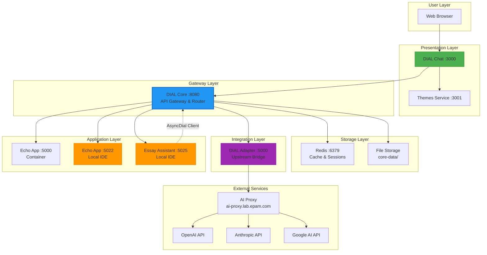

### Design Principles

1. **Separation of Concerns:** Each service has a single, well-defined responsibility
2. **Configuration-Driven:** Behavior controlled via `core/config.json`, not code changes
3. **Developer Ergonomics:** Local apps use `host.docker.internal` for hot-reload workflows
4. **Security by Default:** API keys isolated in gitignored `core/keys.json`
5. **Learning-Focused:** Progressive complexity from T1 (basic) to T5 (advanced)

## Component Architecture

### DIAL Core (Gateway)

**Role:** Central API gateway that routes requests to models and applications

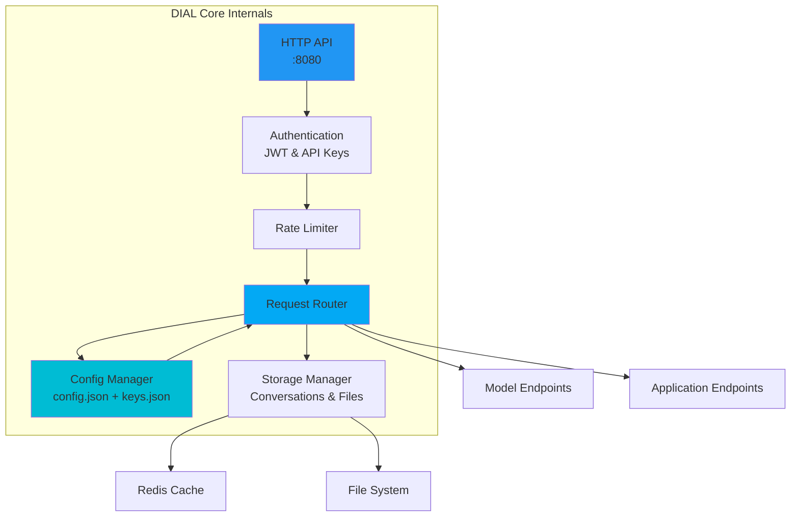

**Key Responsibilities:**
- Request authentication and authorization
- Route requests based on deployment names
- Apply rate limits and quotas per API key
- Manage conversation and file storage
- Merge configuration from multiple sources

**Technology:**
- Java-based (epam/ai-dial-core image)
- Configuration: `/opt/config/config.json`
- Settings: `/opt/settings/settings.json`
- Storage: JClouds filesystem provider

### DIAL Chat (UI)

**Role:** Web-based user interface for interacting with models and applications

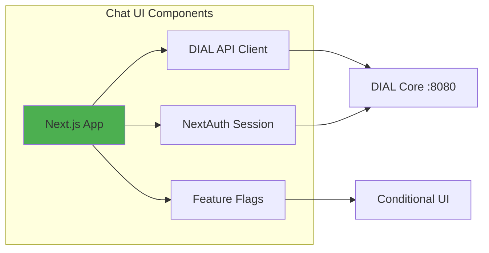

**Key Features:**
- Conversation management
- Prompt library
- File attachments
- Model/application marketplace
- Sharing and publishing
- Custom branding via themes

**Configuration:**
```yaml
Environment Variables:
  DIAL_API_HOST: http://core:8080
  DIAL_API_KEY: dial_api_key
  THEMES_CONFIG_HOST: http://themes:8080
  NEXTAUTH_SECRET: <secret>
  ENABLED_FEATURES: <feature-flags>
```

### DIAL Adapter

**Role:** Bridge between DIAL Core and upstream LLM providers

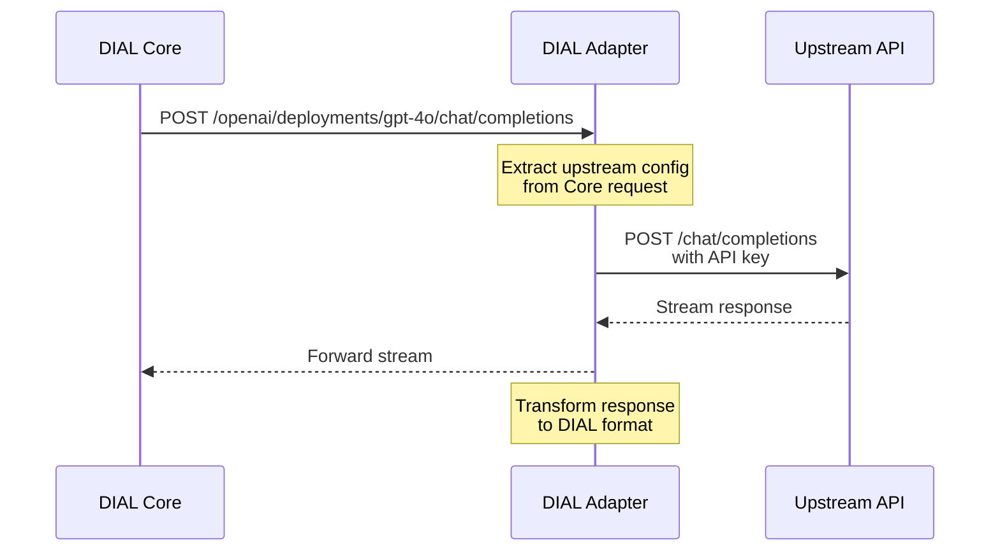

**Responsibilities:**
- Protocol translation (DIAL → OpenAI/Anthropic/Google formats)
- Response streaming
- Error handling and retry logic
- Token counting and metadata

**Configuration:**
```yaml
Environment:
  DIAL_URL: http://core:8080
  LOG_LEVEL: INFO
```

### Redis Cache

**Role:** Fast in-memory storage for sessions and rate limiting

**Usage:**
- Session state
- Rate limit counters
- Temporary conversation cache
- Lock management for distributed operations

**Configuration:**
```yaml
Limits:
  maxmemory: 2000mb
  maxmemory-policy: volatile-lfu
Persistence:
  save: disabled
  appendonly: no
```

## Data Flow Patterns

### Pattern 1: Simple Model Request

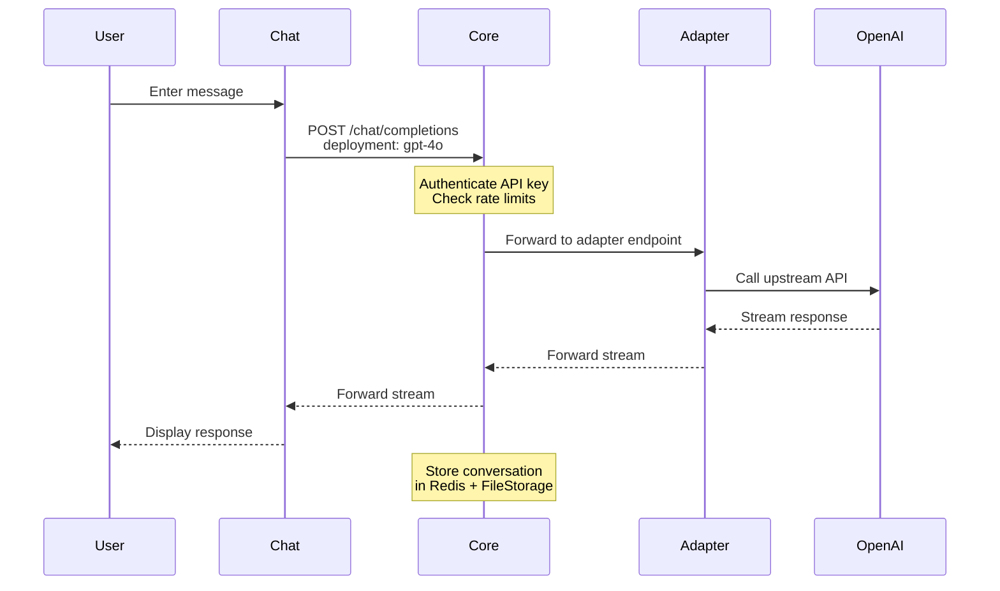

### Pattern 2: Application Request (Echo)

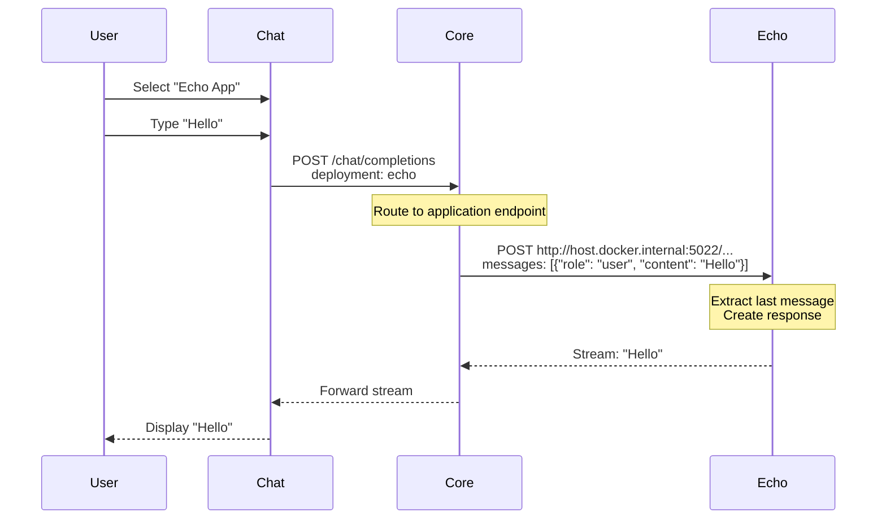

### Pattern 3: Composite Application (Essay Assistant)

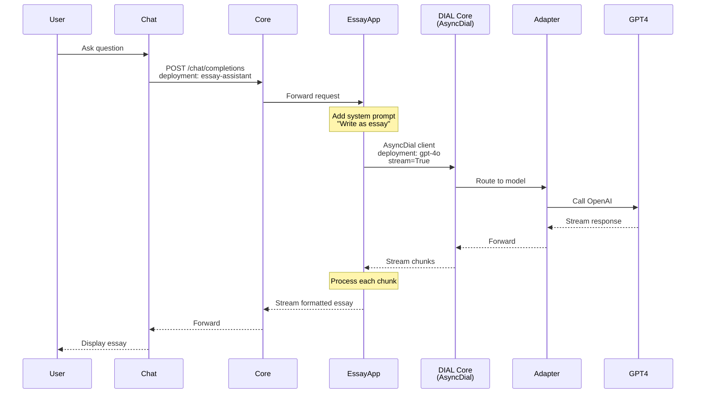

### Pattern 4: Configuration Loading

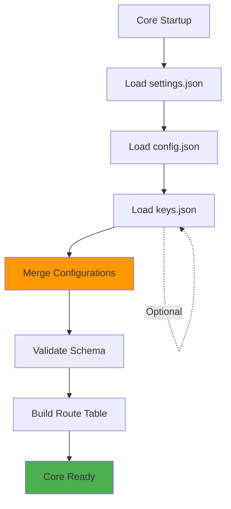

**Configuration Merge Logic:**
1. Load base `config.json` (models, applications, keys, roles)
2. Load `keys.json` (upstreams with API keys) if present
3. Merge `keys.json` upstreams into corresponding models
4. Validate combined configuration
5. Build internal routing table

## Configuration Architecture

### Configuration Hierarchy

```mermaid
graph TD
    subgraph "Configuration Files"
        Settings[settings.json<br/>Server Config]
        Config[config.json<br/>Main Config]
        Keys[keys.json<br/>Secrets]
    end
    
    subgraph "Configuration Sections"
        Models[models: {}]
        Apps[applications: {}]
        Routes[routes: {}]
        APIKeys[keys: {}]
        Roles[roles: {}]
    end
    
    subgraph "Model Definition"
        ModelID[model-id]
        Display[displayName]
        Endpoint[endpoint]
        Upstreams[upstreams: []]
    end
    
    Config --> Models
    Config --> Apps
    Config --> Routes
    Config --> APIKeys
    Config --> Roles
    
    Models --> ModelID
    ModelID --> Display
    ModelID --> Endpoint
    ModelID --> Upstreams
    
    Keys -.Merge.-> Upstreams
    
    style Keys fill:#F44336
    style Config fill:#2196F3
    style Settings fill:#4CAF50
```

### Model Configuration Schema

```json
{
  "models": {
    "<deployment-name>": {
      "displayName": "Human-readable name",
      "endpoint": "http://adapter-dial:5000/...",
      "iconUrl": "http://localhost:3001/icon.svg",
      "type": "chat",
      "upstreams": [
        {
          "endpoint": "https://api.provider.com/...",
          "key": "${ENV_VAR_OR_LITERAL}"
        }
      ]
    }
  }
}
```

### Application Configuration Schema

```json
{
  "applications": {
    "<deployment-name>": {
      "displayName": "Human-readable name",
      "description": "What this app does",
      "endpoint": "http://host.docker.internal:PORT/..."
    }
  }
}
```

**Key Design Decision:** Applications running locally (in IDE) use `host.docker.internal` to allow Core (in container) to reach the host machine.

### API Key & Role Configuration

```json
{
  "keys": {
    "dial_api_key": {
      "project": "TEST-PROJECT",
      "role": "default"
    }
  },
  "roles": {
    "default": {
      "limits": {
        "minute": "256000",
        "day": "1000000",
        "week": "1256000",
        "month": "11256000"
      }
    }
  }
}
```

## Development Patterns

### Pattern: Container vs Local Development

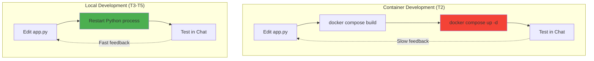

**Recommendation:** Use local development (T3+ pattern) for rapid iteration.

### Pattern: DIAL SDK Application Structure

```python
from aidial_sdk import DIALApp
from aidial_sdk.chat_completion import ChatCompletion, Request, Response

class MyApplication(ChatCompletion):
    async def chat_completion(self, request: Request, response: Response):
        # 1. Extract input from request
        last_message = request.messages[-1]
        
        # 2. Process (business logic)
        result = process_message(last_message.content)
        
        # 3. Stream response
        with response.create_single_choice() as choice:
            choice.append_content(result)

# 4. Register application
app = DIALApp()
app.add_chat_completion("deployment-name", MyApplication())

# 5. Run server
if __name__ == "__main__":
    import uvicorn
    uvicorn.run(app, port=5025, host="0.0.0.0")
```

### Pattern: AsyncDial Client Usage

```python
from aidial_client import AsyncDial

client = AsyncDial(
    base_url="http://localhost:8080",
    api_key="dial_api_key",
    api_version="2025-01-01-preview"
)

# Streaming chat completion
chunks = await client.chat.completions.create(
    deployment_name="gpt-4o",
    stream=True,
    messages=[{"role": "user", "content": "..."}]
)

async for chunk in chunks:
    if chunk.choices:
        delta = chunk.choices[0].delta
        if delta and delta.content:
            # Process streamed content
            yield delta.content
```

## Deployment Architecture

### Docker Compose Service Topology

```mermaid
graph TD
    subgraph "Frontend Network"
        Chat[chat :3000]
        Themes[themes :3001]
    end
    
    subgraph "Backend Network"
        Core[core :8080]
        Redis[redis :6379]
        Adapter[adapter-dial :5000]
    end
    
    subgraph "Host Machine"
        Echo[echo :5022]
        Essay[essay-assistant :5025]
    end
    
    Chat --> Core
    Chat --> Themes
    Core --> Redis
    Core --> Adapter
    Core -.host.docker.internal.-> Echo
    Core -.host.docker.internal.-> Essay
    
    Essay -.AsyncDial.-> Core
```

### Volume Mounts

| Service | Mount | Purpose |
|---------|-------|---------|
| `core` | `./settings:/opt/settings` | Server configuration |
| `core` | `./core:/opt/config` | DIAL configuration |
| `core` | `./core-logs:/app/log` | Log persistence |
| `core` | `./core-data:/app/data` | File storage (conversations) |

### Network Configuration

**Default Bridge Network:** All services communicate via Docker's default bridge network using service names as hostnames.

**Host Access:** Local applications (outside Docker) are accessed via `host.docker.internal` from within containers.

**Port Mapping:**
```yaml
chat:        3000:3000
themes:      3001:8080
core:        8080:8080
redis:       6379:6379
adapter-dial: (no external port)
```

## Security Considerations

### API Key Management

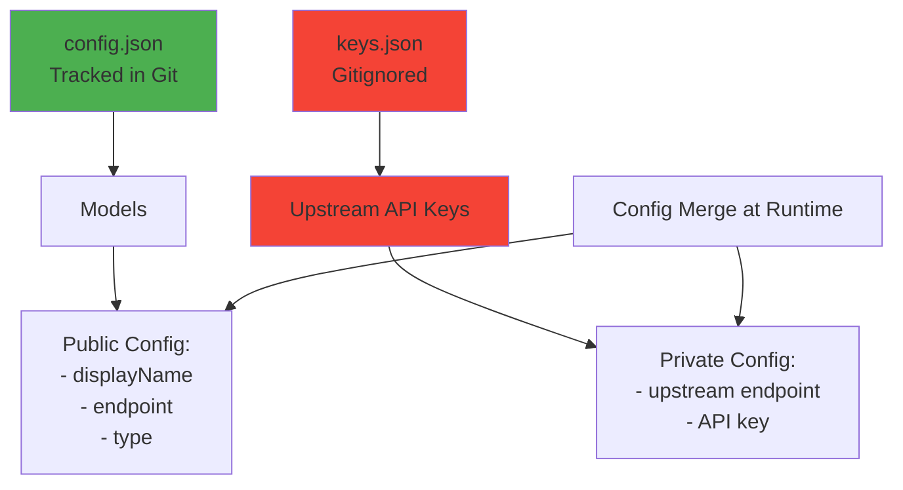

**Best Practices:**
1. ✅ Store sensitive keys in `core/keys.json` (gitignored)
2. ✅ Use placeholders in `config.json`: `"key": "${API_KEY}"`
3. ❌ NEVER commit API keys to Git
4. ✅ Rotate keys regularly
5. ✅ Use environment-specific keys (dev vs prod)

### Authentication Flow

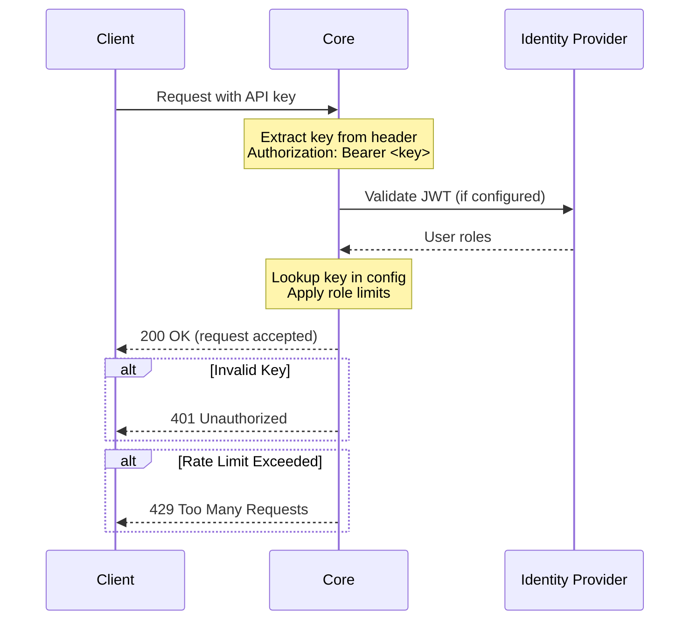

### Rate Limiting

**Configured per role in `config.json`:**
```json
{
  "roles": {
    "default": {
      "limits": {
        "minute": "256000",   // tokens per minute
        "day": "1000000",     // tokens per day
        "week": "1256000",    // tokens per week
        "month": "11256000"   // tokens per month
      }
    }
  }
}
```

**Implementation:** Redis-based counters with sliding window algorithm.

## Architecture Decisions

For detailed rationale, see [ADR Directory](./adr/).

### ADR-001: Configuration-Driven Architecture
**Decision:** Use JSON configuration files instead of environment variables or code-based config.
**Rationale:** Easier onboarding, version control, and multi-environment support.

### ADR-002: Local Development via host.docker.internal
**Decision:** Applications running locally connect to Core using `host.docker.internal`.
**Rationale:** Enables hot-reload workflows without Docker rebuilds.

### ADR-003: Separated Secrets (keys.json)
**Decision:** Split sensitive upstreams configuration into gitignored `keys.json`.
**Rationale:** Prevents accidental API key commits while maintaining main config readability.

### ADR-004: Docker Compose for Orchestration
**Decision:** Use Docker Compose instead of Kubernetes or manual Docker commands.
**Rationale:** Lower barrier to entry for learners, simpler local development.

### ADR-005: Task-Based Learning Progression
**Decision:** Structure learning as sequential tasks (T1-T5) with increasing complexity.
**Rationale:** Progressive disclosure of concepts improves retention and reduces overwhelm.

## Constraints and Limitations

### Known Constraints

1. **Single-Machine Only:** Not designed for distributed deployment
2. **No TLS:** Uses HTTP internally (not production-ready)
3. **Stateful Storage:** Conversations stored locally (not cloud-backed)
4. **No Auto-Scaling:** Fixed resource allocation
5. **Learning Environment:** Not hardened for production use

### Resource Requirements

| Service | CPU | Memory | Disk |
|---------|-----|--------|------|
| chat | 0.5 | 512MB | - |
| themes | 0.2 | 256MB | - |
| core | 1.0 | 1GB | 1GB (logs/data) |
| redis | 0.5 | 2GB | - |
| adapter-dial | 0.5 | 512MB | - |
| **Total** | **2.7 cores** | **4.3GB** | **1GB+** |

### Platform-Specific Issues

**macOS:**
- Requires `platform: linux/amd64` for ARM Macs (M1/M2/M3)
- `host.docker.internal` works natively

**Windows:**
- Docker Desktop required (WSL2 backend recommended)
- `host.docker.internal` available in newer Docker versions

**Linux:**
- May need `--add-host=host.docker.internal:host-gateway` flag
- Or use `172.17.0.1` (Docker bridge IP) instead

## Monitoring and Observability

### Logs

**Core Logs:** `./core-logs/` (mounted volume)
```bash
tail -f core-logs/application.log
```

**Container Logs:**
```bash
docker compose logs -f core
docker compose logs -f adapter-dial
```

**Application Logs:** Stdout from Python apps
```bash
python app.py  # Logs to console
```

### Health Checks

**Core Health:**
```bash
curl http://localhost:8080/health
```

**Chat UI:**
```bash
curl http://localhost:3000/api/health
```

**Redis:**
```bash
docker compose exec redis redis-cli PING
# Expected: PONG
```

## Future Architecture Considerations

TODO: Requires confirmation from project stakeholders

- **Metrics Collection:** Prometheus/Grafana integration
- **Distributed Tracing:** OpenTelemetry support
- **Kubernetes Support:** Helm charts for production deployment
- **Database Backend:** PostgreSQL for conversation persistence
- **Authentication:** OIDC/OAuth2 integration
- **Multi-Tenancy:** Isolated projects and workspaces

---

**Related Documents:**
- [API Reference](./api.md) - Detailed endpoint documentation
- [Setup Guide](./setup.md) - Installation and configuration
- [ADR Directory](./adr/) - Architecture decision records
- [Glossary](./glossary.md) - Domain terminology
