# Learning Roadmap

## Overview

This roadmap guides you through building DIAL applications via **5 progressive tasks (T1-T5)**. Each task builds on previous concepts and introduces new skills.

**Total Time:** ~95 minutes  
**Prerequisites:** Docker, Python 3.11+, basic command-line skills

```mermaid
graph LR
    START([Start Here]) --> T1
    T1[T1: Basic Setup<br/>⏱️ 10 min] --> CHOICE{Want to learn<br/>containerization?}
    CHOICE -->|Yes| T2[T2: Container App<br/>⏱️ 20 min<br/>OPTIONAL]
    CHOICE -->|No| T3
    T2 --> T3[T3: Local Dev<br/>⏱️ 15 min]
    T3 --> T4[T4: Add Models<br/>⏱️ 20 min]
    T4 --> T5[T5: Composite App<br/>⏱️ 30 min]
    T5 --> DONE([🎉 Complete!])
    
    style T1 fill:#4CAF50
    style T2 fill:#8BC34A,stroke-dasharray: 5 5
    style T3 fill:#FFC107
    style T4 fill:#FF9800
    style T5 fill:#F44336
    style START fill:#2196F3
    style DONE fill:#9C27B0
```



## Learning Path

### Quick Start (Recommended)
**Path:** T1 → T3 → T4 → T5  
**Time:** ~65 minutes  
**Focus:** Rapid development workflow

### Complete Path
**Path:** T1 → T2 → T3 → T4 → T5  
**Time:** ~95 minutes  
**Focus:** Full understanding including containerization

---

## Task 1: Basic DIAL Setup

**Goal:** Get DIAL Chat running with zero configuration.

**Time:** 10 minutes

**Skills Learned:**
- Docker Compose basics
- Service orchestration
- DIAL architecture overview
- Health checking

### Prerequisites
- Docker Desktop installed
- Terminal/command prompt access
- 8GB RAM available

### Instructions

#### Step 1: Start Services

From project root:
```bash
docker compose up -d
```

**Expected Output:**
```
[+] Running 5/5
 ✔ Network ai-dial-dial-local-setup_default  Created
 ✔ Container redis                           Started
 ✔ Container themes                          Started
 ✔ Container core                            Started
 ✔ Container chat                            Started
```

#### Step 2: Verify Services

```bash
docker compose ps -a
```

**Expected:** All services show "Up" status.

**⚠️ macOS ARM Users (M1/M2/M3):**  
If services fail, uncomment `platform: linux/amd64` for each service in docker-compose.yml.

#### Step 3: Access DIAL Chat

Open browser: [http://localhost:3000/marketplace](http://localhost:3000/marketplace)

**Expected:** DIAL Chat loads, marketplace is empty (normal at this stage).

#### Step 4: Explore UI

Try navigating to chat view. You'll see:
> "Not available agent selected. Please, change the agent to proceed"

**This is correct!** We haven't added any models or applications yet.

### Verification

- [ ] `docker compose ps -a` shows all services "Up"
- [ ] Chat UI accessible at localhost:3000
- [ ] No error messages in `docker compose logs core`
- [ ] Redis responds: `docker compose exec redis redis-cli PING` → "PONG"

### What You Learned

✅ How to start DIAL services with Docker Compose  
✅ DIAL architecture (Core, Chat, Redis, Themes)  
✅ Service health verification  
✅ UI navigation

### Common Issues

**Issue:** Containers won't start  
**Fix:** Check Docker Desktop is running, ports 3000/8080/6379 not in use

**Issue:** "Connection refused" errors  
**Fix:** Wait 30 seconds for services to fully start, then refresh browser

### Next Step

**Recommended:** [Task 3 - Local Development](#task-3-local-development-workflow)  
**Alternative:** [Task 2 - Containerized App](#task-2-first-containerized-application-optional) (optional)

---

## Task 2: First Containerized Application (Optional)

**Goal:** Build and deploy Echo app in Docker container.

**Time:** 20 minutes

**Skills Learned:**
- DIAL SDK basics
- Dockerfile creation
- Extended Docker Compose
- Container networking

**Why Optional?** Task 3 teaches faster development pattern. This task shows containerization concepts but isn't required for subsequent tasks.

### Prerequisites
- Completed Task 1
- Docker knowledge helpful

### Instructions

#### Step 1: Stop Current Services

```bash
docker compose down -v --remove-orphans
```

#### Step 2: Review Echo Application

Open [tasks/t2/echo/app.py](../../tasks/t2/echo/app.py):

```python
from aidial_sdk import DIALApp
from aidial_sdk.chat_completion import ChatCompletion, Request, Response

class EchoApplication(ChatCompletion):
    async def chat_completion(self, request: Request, response: Response):
        last_user_message = request.messages[-1]
        with response.create_single_choice() as choice:
            choice.append_content(last_user_message.content or "")

app = DIALApp()
app.add_chat_completion("echo", EchoApplication())
```

**What it does:** Repeats user's message back.

#### Step 3: Review Dockerfile

Open [tasks/t2/echo/Dockerfile](../../tasks/t2/echo/Dockerfile):

```dockerfile
FROM python:3.11-alpine
WORKDIR /app
COPY * /app
RUN pip install -r requirements.txt
EXPOSE 5000
CMD ["python", "app.py"]
```

#### Step 4: Start Extended Compose

```bash
cd tasks/t2
docker compose up -d
```

This extends root compose and adds Echo container.

#### Step 5: Configure Core

Edit [tasks/t2/core/config.json](../../tasks/t2/core/config.json), add to `applications`:

```json
{
  "applications": {
    "echo": {
      "displayName": "My Echo App",
      "description": "Simple application that repeats user's message",
      "endpoint": "http://echo:5000/openai/deployments/echo/chat/completions"
    }
  }
}
```

**Note:** `http://echo:5000` uses Docker service name.

#### Step 6: Restart Services

```bash
docker compose stop && docker compose up -d --build
```

#### Step 7: Test Echo App

1. Open [http://localhost:3000/marketplace](http://localhost:3000/marketplace)
2. Find "My Echo App"
3. Start conversation
4. Type: `Hooray, eventually the Echo app running in Docker container is up`
5. Expected: Same message echoed back

### Verification

- [ ] Echo container running: `docker compose ps | grep echo`
- [ ] Echo app visible in marketplace
- [ ] Can send message and receive echo
- [ ] Container logs show requests: `docker compose logs echo`

### What You Learned

✅ DIAL SDK structure (DIALApp, ChatCompletion)  
✅ Building Docker images for applications  
✅ Container-based application deployment  
✅ Docker Compose service extension

### Common Issues

**Issue:** Echo container crashes  
**Fix:** Check logs: `docker compose logs echo`

**Issue:** Echo not in marketplace  
**Fix:** Verify config.json syntax, restart Core

**Issue:** Build fails on ARM Mac  
**Fix:** Add `platform: linux/amd64` to echo service

### Limitations of Container Development

- **Slow:** Each code change requires rebuild (30-60 seconds)
- **Debug Difficulty:** Can't use IDE debugger easily
- **Resource Intensive:** Each container uses memory

**Task 3 solves these problems!**

### Next Step

[Task 3 - Local Development](#task-3-local-development-workflow)

---

## Task 3: Local Development Workflow

**Goal:** Run Echo app locally with fast iteration.

**Time:** 15 minutes

**Skills Learned:**
- host.docker.internal pattern
- Local IDE development
- Hot reload workflow
- Rapid iteration

**This is the recommended development pattern!**

### Prerequisites
- Completed Task 1 (Task 2 optional)
- Python 3.11+ installed

### Instructions

#### Step 1: Stop T2 Compose (if running)

```bash
cd tasks/t2
docker compose down -v --remove-orphans
```

#### Step 2: Start Root Compose

```bash
cd ../../  # Back to project root
docker compose up -d
```

#### Step 3: Configure Echo App

Edit [core/config.json](../../core/config.json), add to `applications`:

```json
{
  "applications": {
    "echo": {
      "displayName": "My Echo App",
      "description": "Simple application that repeats user's message",
      "endpoint": "http://host.docker.internal:5022/openai/deployments/echo/chat/completions"
    }
  }
}
```

**Key Change:** `host.docker.internal:5022` instead of `echo:5000`

**Why?** Core (in Docker) needs to reach host machine (where Python runs).

#### Step 4: Restart Core

```bash
docker compose stop core && docker compose up -d core
```

#### Step 5: Create Virtual Environment

```bash
cd tasks/t3/echo
python3.11 -m venv venv
source venv/bin/activate  # macOS/Linux
# venv\Scripts\activate   # Windows
```

#### Step 6: Install Dependencies

```bash
pip install -r requirements.txt
```

**Contents:**
```
aidial-sdk==0.27.0
```

#### Step 7: Run Application Locally

```bash
python app.py
```

**Expected Output:**
```
INFO:     Uvicorn running on http://0.0.0.0:5022
```

**Keep this terminal running!**

#### Step 8: Test Echo App

1. Open [http://localhost:3000/marketplace](http://localhost:3000/marketplace)
2. Find "My Echo App"
3. Type: `Hello, Echo!`
4. Expected: `Hello, Echo!`

#### Step 9: Make Live Changes

**Edit** [tasks/t3/echo/app.py](../../tasks/t3/echo/app.py), change line:

```python
choice.append_content(last_user_message.content or "")
```

To:

```python
choice.append_content(f"abracadabra\n{last_user_message.content}" or "Oops...")
```

**Save file.**

#### Step 10: Restart Python App

In terminal running app, press **Ctrl+C**, then:

```bash
python app.py
```

**No Docker rebuild needed!**

#### Step 11: Test Again

Send another message in Chat. Expected: `abracadabra` prefix appears!

### Verification

- [ ] Python app runs on port 5022
- [ ] Echo works in Chat UI
- [ ] Can edit code and see changes after Python restart (2-5 seconds)
- [ ] No Docker rebuild required
- [ ] App logs visible in terminal

### What You Learned

✅ host.docker.internal for local development  
✅ Fast iteration workflow  
✅ IDE debugging capability  
✅ Virtual environment management

### Common Issues

**Issue:** "Connection refused" from Core  
**Fix:** Verify endpoint uses `host.docker.internal`, not `localhost`

**Linux:** Add to core service in docker-compose.yml:
```yaml
extra_hosts:
  - "host.docker.internal:host-gateway"
```

**Issue:** Port 5022 already in use  
**Fix:** Change port in both app.py and config.json

**Issue:** "Module not found" error  
**Fix:** Activate venv: `source venv/bin/activate`

### Development Workflow

**Iteration Loop:**
1. Edit app.py
2. Ctrl+C (stop Python)
3. `python app.py` (restart)
4. Test in browser
5. **Total time: ~5 seconds** ⚡

**Compare to T2 (container):**
1. Edit app.py
2. `docker compose build`
3. `docker compose up -d`
4. Test
5. **Total time: ~60 seconds** 🐌

### Next Step

[Task 4 - Integrating Models](#task-4-integrating-models)

---

## Task 4: Integrating Models

**Goal:** Add real AI models (GPT-4, Claude, Gemini) via adapters.

**Time:** 20 minutes

**Skills Learned:**
- Model configuration
- Adapter deployment
- Upstream provider setup
- API key management
- Rate limiting

### Prerequisites
- Completed Task 1 & 3
- DIAL API key (or upstream provider API keys)

### Instructions

#### Step 1: Add GPT-4 Model Configuration

Edit [core/config.json](../../core/config.json), add to `models`:

```json
{
  "models": {
    "gpt-4o": {
      "displayName": "GPT 4o",
      "endpoint": "http://adapter-dial:5000/openai/deployments/gpt-4o/chat/completions",
      "iconUrl": "http://localhost:3001/gpt4.svg",
      "type": "chat",
      "upstreams": [
        {
          "endpoint": "https://ai-proxy.lab.epam.com/openai/deployments/gpt-4o/chat/completions",
          "key": "{REPLACE_WITH_YOUR_API_KEY}"
        }
      ]
    }
  }
}
```

**⚠️ Replace** `{REPLACE_WITH_YOUR_API_KEY}` with actual API key.

#### Step 2: Test Without Adapter (Will Fail)

```bash
docker compose stop && docker compose up -d --build
```

Open Chat, select GPT-4o, send message.

**Expected:** Error! Adapter service not running.

#### Step 3: Add Adapter Service

Edit [docker-compose.yml](../../docker-compose.yml), add service:

```yaml
services:
  # ... existing services ...
  
  adapter-dial:
    image: epam/ai-dial-adapter-dial:development
    # Uncomment for macOS ARM:
    # platform: linux/amd64
    environment:
      DIAL_URL: "http://core:8080"
      LOG_LEVEL: "INFO"
```

#### Step 4: Restart with Adapter

```bash
docker compose stop && docker compose up -d --build
```

Verify adapter running:
```bash
docker compose ps -a | grep adapter-dial
```

#### Step 5: Test GPT-4

1. Open [http://localhost:3000](http://localhost:3000)
2. Select "GPT 4o" from dropdown
3. Type: `Hi, what can you do?`
4. Expected: Response from GPT-4

#### Step 6: Add More Models

Edit [core/config.json](../../core/config.json), add:

```json
{
  "models": {
    "claude-3-7-sonnet@20250219": {
      "displayName": "sonnet 3.7",
      "endpoint": "http://adapter-dial:5000/openai/deployments/claude-3-7-sonnet@20250219/chat/completions",
      "type": "chat",
      "upstreams": [
        {
          "endpoint": "https://ai-proxy.lab.epam.com/openai/deployments/claude-3-7-sonnet@20250219/chat/completions",
          "key": "{YOUR_API_KEY}"
        }
      ]
    },
    "gemini-2.5-pro": {
      "displayName": "Gemini 2.5 Pro",
      "endpoint": "http://adapter-dial:5000/openai/deployments/gemini-2.5-pro/chat/completions",
      "iconUrl": "http://localhost:3001/Gemini-Pro-Vision.svg",
      "type": "chat",
      "upstreams": [
        {
          "endpoint": "https://ai-proxy.lab.epam.com/openai/deployments/gemini-2.5-pro/chat/completions",
          "key": "{YOUR_API_KEY}"
        }
      ]
    }
  }
}
```

#### Step 7: Configure Rate Limits

Edit [core/config.json](../../core/config.json), update `roles`:

```json
{
  "roles": {
    "default": {
      "limits": {
        "minute": "256000",
        "day": "1000000",
        "week": "1256000",
        "month": "11256000"
      }
    }
  }
}
```

**Units:** Token counts (not requests)

#### Step 8: Restart and Test All Models

```bash
docker compose stop core && docker compose up -d core
```

Test each model in Chat UI.

### Verification

- [ ] Adapter service running
- [ ] GPT-4o, Claude, Gemini in dropdown
- [ ] All models respond correctly
- [ ] No 401/403 errors (API keys valid)
- [ ] Response times reasonable (< 30s)

### What You Learned

✅ Model configuration structure  
✅ Adapter purpose and deployment  
✅ Upstream provider integration  
✅ API key management  
✅ Rate limiting configuration

### Common Issues

**Issue:** 401 Unauthorized  
**Fix:** Verify API key is correct in upstreams

**Issue:** Adapter not found  
**Fix:** Check adapter service name in endpoint matches docker-compose.yml

**Issue:** Slow responses  
**Fix:** Check adapter logs for upstream issues: `docker compose logs adapter-dial`

### Security Reminder

**⚠️ Never commit API keys to Git!**

**Best Practice:** Move upstreams to `core/keys.json` (see [ADR-003](./adr/ADR-003-separated-secrets-keys-json.md)).

**Example keys.json:**
```json
{
  "models": {
    "gpt-4o": {
      "upstreams": [{
        "endpoint": "https://...",
        "key": "actual-key-here"
      }]
    }
  }
}
```

Then remove upstreams from config.json. Core merges both files automatically.

### Next Step

[Task 5 - Composite Applications](#task-5-composite-applications)

---

## Task 5: Composite Applications

**Goal:** Build Essay Assistant that calls GPT-4 with custom system prompt.

**Time:** 30 minutes

**Skills Learned:**
- AsyncDial client usage
- System prompts
- Streaming responses
- Application composition
- Advanced patterns

**This is the capstone task!** Combines all previous concepts.

### Prerequisites
- Completed Tasks 1, 3, 4
- GPT-4 model working from Task 4

### Instructions

#### Step 1: Review Application Template

Open [tasks/t5/essay_assistant/app.py](../../tasks/t5/essay_assistant/app.py).

You'll see:
- System prompt defining essay format
- TODO comments guiding implementation
- AsyncDial client placeholder

#### Step 2: Create Virtual Environment

```bash
cd tasks/t5/essay_assistant
python3.11 -m venv venv
source venv/bin/activate  # macOS/Linux
pip install -r requirements.txt
```

**Dependencies:**
```
aidial-sdk==0.27.0
aidial-client==0.3.0
```

#### Step 3: Implement AsyncDial Client

**Find TODO #1**, implement:

```python
client = AsyncDial(
    base_url="http://localhost:8080",
    api_key="dial_api_key",
    api_version="2025-01-01-preview"
)
```

**Why these values?**
- `base_url`: Local Core instance
- `api_key`: Defined in config.json keys section
- `api_version`: Required by DIAL protocol

#### Step 4: Implement Streaming Logic

**Find TODO #2**, implement:

```python
with response.create_single_choice() as choice:
    chunks = await client.chat.completions.create(
        deployment_name="gpt-4o",
        stream=True,
        messages=[
            {"role": "system", "content": SYSTEM_PROMPT},
            {"role": "user", "content": request.messages[-1].content}
        ]
    )
    
    async for chunk in chunks:
        if chunk.choices:
            delta = chunk.choices[0].delta
            if delta and delta.content:
                choice.append_content(delta.content)
```

**What it does:**
1. Create response choice
2. Call GPT-4 via AsyncDial (streaming enabled)
3. Add system prompt + user message
4. Stream each chunk to user

#### Step 5: Register Application

**Find TODO #3**, implement:

```python
app.add_chat_completion("essay-assistant", EssayAssistantApplication())
```

#### Step 6: Run Application

```bash
python app.py
```

**Expected:**
```
INFO:     Uvicorn running on http://0.0.0.0:5025
```

#### Step 7: Configure in Core

Edit [core/config.json](../../core/config.json), add to `applications`:

```json
{
  "applications": {
    "essay-assistant": {
      "displayName": "Essay Assistant",
      "description": "Essay Assistant. Always answers with essay.",
      "endpoint": "http://host.docker.internal:5025/openai/deployments/essay-assistant/chat/completions"
    }
  }
}
```

**Note:** Port 5025 matches app.py uvicorn.run port.

#### Step 8: Restart Core

```bash
docker compose stop core && docker compose up -d core
```

#### Step 9: Test Essay Assistant

1. Open [http://localhost:3000/marketplace](http://localhost:3000/marketplace)
2. Find "Essay Assistant"
3. Type: `What is artificial intelligence?`
4. Expected: Structured essay with intro, body, conclusion

#### Step 10: Observe Streaming

Watch response appear word-by-word (streaming from GPT-4 → Essay App → Core → Chat).

### Verification

- [ ] Python app runs on port 5025
- [ ] Essay Assistant in marketplace
- [ ] Responses are essay-formatted (not just answers)
- [ ] Streaming works (incremental display)
- [ ] App logs show GPT-4 requests
- [ ] No errors in terminal or Core logs

### What You Learned

✅ AsyncDial client for calling other models  
✅ System prompts for behavior control  
✅ Streaming response forwarding  
✅ Composite application pattern  
✅ Complete development workflow

### Complete Application Code

<details>
<summary>Click to see full solution</summary>

```python
import uvicorn
from aidial_client import AsyncDial
from aidial_sdk import DIALApp
from aidial_sdk.chat_completion import ChatCompletion, Request, Response

SYSTEM_PROMPT = """You are an essay-focused assistant. Respond to every request by writing a **short essay** of up to 300 tokens.

**Structure:**
- Clear introduction with thesis
- Body paragraphs with supporting points
- Concise conclusion

**Rules:**
- Always write in essay format regardless of topic
- Keep responses analytical and structured
- Use formal, academic tone
- Include specific examples when relevant
- Maintain logical flow between paragraphs
"""


class EssayAssistantApplication(ChatCompletion):
    async def chat_completion(self, request: Request, response: Response):
        client = AsyncDial(
            base_url="http://localhost:8080",
            api_key="dial_api_key",
            api_version="2025-01-01-preview"
        )
        
        with response.create_single_choice() as choice:
            chunks = await client.chat.completions.create(
                deployment_name="gpt-4o",
                stream=True,
                messages=[
                    {"role": "system", "content": SYSTEM_PROMPT},
                    {"role": "user", "content": request.messages[-1].content}
                ]
            )
            
            async for chunk in chunks:
                if chunk.choices:
                    delta = chunk.choices[0].delta
                    if delta and delta.content:
                        choice.append_content(delta.content)


app = DIALApp()
app.add_chat_completion("essay-assistant", EssayAssistantApplication())

if __name__ == "__main__":
    uvicorn.run(app, port=5025, host="0.0.0.0")
```
</details>

### Common Issues

**Issue:** "Module not found: aidial_client"  
**Fix:** Verify requirements.txt includes `aidial-client==0.3.0`, reinstall

**Issue:** Essay Assistant returns plain answers (not essays)  
**Fix:** Check SYSTEM_PROMPT is passed in messages array

**Issue:** Streaming doesn't work  
**Fix:** Ensure `stream=True` and loop properly handles chunks

**Issue:** 401 from AsyncDial client  
**Fix:** Verify `api_key="dial_api_key"` matches config.json keys

### Architecture Flow


### Extension Ideas

**Try modifying:**
1. **Change system prompt** - Make it write poems, code comments, etc.
2. **Add error handling** - Handle AsyncDial exceptions
3. **Add parameters** - Let user control essay length
4. **Call multiple models** - Compare GPT-4 vs Claude essays
5. **Add conversation context** - Use full message history

### 🎉 Congratulations!

You've completed all tasks! You now know how to:
- Set up DIAL infrastructure
- Build containerized and local applications
- Configure models and adapters
- Create composite applications
- Use AsyncDial client
- Implement streaming responses

### Next Steps

**Keep Learning:**
- [API Reference](./api.md) - Deep dive into DIAL SDK
- [Architecture Guide](./architecture.md) - Understand system design
- [Testing Guide](./testing.md) - Write tests for apps

**Build Something:**
- Translation assistant (calls multiple language models)
- Code reviewer (analyzes code with AI)
- Research assistant (combines search + summarization)
- Creative writer (GPT-4 for ideas, Claude for editing)

**Security:**
⚠️ **Remove API keys from config.json before committing!**

Move to `core/keys.json` (gitignored) - see [Setup Guide](./setup.md#securing-api-keys).

---

## Task Summary

| Task | Time | Skills | Complexity |
|------|------|--------|------------|
| **T1** | 10 min | Docker, services | ⭐ |
| **T2** | 20 min | Containers, SDK | ⭐⭐ (optional) |
| **T3** | 15 min | Local dev, hot reload | ⭐⭐ |
| **T4** | 20 min | Models, adapters | ⭐⭐⭐ |
| **T5** | 30 min | AsyncDial, composition | ⭐⭐⭐⭐ |

## Completion Checklist

### Task 1
- [ ] All Docker services running
- [ ] Chat UI accessible
- [ ] Marketplace loads (empty is OK)

### Task 2 (Optional)
- [ ] Echo container built and running
- [ ] Echo app works in Chat
- [ ] Understand containerized workflow

### Task 3
- [ ] Echo runs locally (Python process)
- [ ] Can edit and reload quickly
- [ ] host.docker.internal pattern understood

### Task 4
- [ ] 3+ models configured (GPT-4, Claude, Gemini)
- [ ] Adapter service running
- [ ] All models respond correctly
- [ ] Rate limits configured

### Task 5
- [ ] Essay Assistant running locally
- [ ] Generates essay-format responses
- [ ] Streaming works correctly
- [ ] Understand AsyncDial pattern

## Related Documentation

- [Setup Guide](./setup.md) - Installation and troubleshooting
- [API Reference](./api.md) - Complete API documentation
- [Architecture Guide](./architecture.md) - System design
- [Testing Guide](./testing.md) - Quality assurance
- [Glossary](./glossary.md) - Term definitions
- [ADRs](./adr/) - Design decisions

---

**Questions or stuck?** Check the [Setup Guide - Troubleshooting](./setup.md#troubleshooting) section.

**Ready to go deeper?** Explore the [Architecture Guide](./architecture.md) to understand system design.
