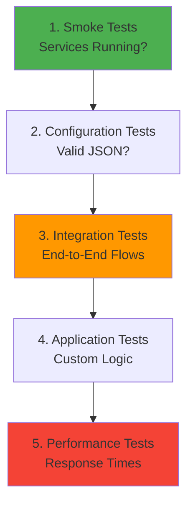
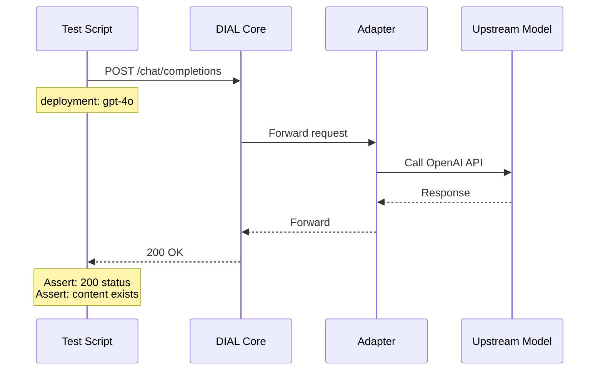

# Testing Strategy

## Table of Contents
- [Overview](#overview)
- [Testing Levels](#testing-levels)
- [Manual Testing](#manual-testing)
- [Integration Testing](#integration-testing)
- [Application Testing Patterns](#application-testing-patterns)
- [Configuration Validation](#configuration-validation)
- [Performance Testing](#performance-testing)
- [Test Checklist](#test-checklist)

## Overview

DIAL Local Setup is a **learning environment** focused on hands-on experimentation. Testing here emphasizes:
- **Manual validation** through DIAL Chat UI
- **Integration testing** of complete request flows
- **Configuration validation** to prevent runtime errors
- **API contract testing** for custom applications

**Note:** This project does not include automated unit tests as it's designed for learning, not production deployment.

## Testing Levels



### Level 1: Smoke Tests
**Purpose:** Verify basic system health

**Frequency:** After every `docker compose up`

**Tests:**
- All containers running
- Ports accessible
- UI loads

### Level 2: Configuration Tests
**Purpose:** Validate configuration files

**Frequency:** After config changes

**Tests:**
- JSON syntax valid
- Required fields present
- Endpoint URLs reachable

### Level 3: Integration Tests
**Purpose:** End-to-end request flows

**Frequency:** After adding models/apps

**Tests:**
- Model completions work
- Applications respond
- Streaming functions correctly

### Level 4: Application Tests
**Purpose:** Custom application logic

**Frequency:** During app development

**Tests:**
- Input parsing correct
- Business logic accurate
- Response format valid

### Level 5: Performance Tests
**Purpose:** Response time benchmarks

**Frequency:** Before sharing/deployment

**Tests:**
- Latency under load
- Memory usage stable
- No memory leaks

## Manual Testing

### Testing via DIAL Chat UI

**Recommended:** Primary testing method for learners.

#### Test Model Configuration

1. **Open Chat UI:** [http://localhost:3000](http://localhost:3000)
2. **Select Model:** Click dropdown, choose model (e.g., "GPT-4o")
3. **Send Test Message:**
   ```
   Respond with exactly: "Test successful"
   ```
4. **Verify Response:** Should receive exact text back

**Checklist:**
- [ ] Model appears in dropdown
- [ ] Can send message
- [ ] Receive response within 10 seconds
- [ ] Response is coherent
- [ ] No error messages in UI

#### Test Application Configuration

1. **Navigate to Marketplace:** Click Marketplace icon
2. **Find Application:** Locate your app (e.g., "Echo App")
3. **Start Conversation:** Click app tile
4. **Send Test Input:**
   ```
   Test message 123
   ```
5. **Verify Output:** Should match expected behavior

**Checklist:**
- [ ] App appears in marketplace
- [ ] App tile shows correct name/description
- [ ] Can start conversation
- [ ] Response matches logic
- [ ] No console errors (F12 DevTools)

#### Test Streaming Responses

1. **Select Streaming Model/App**
2. **Send Long Request:**
   ```
   Write a 200-word story about a robot learning to cook.
   ```
3. **Observe:** Response should appear word-by-word, not all at once

**Checklist:**
- [ ] Response streams incrementally
- [ ] No long pauses mid-stream
- [ ] Complete response received
- [ ] Finish reason indicated

### Testing via cURL

**Use Case:** Quick API validation without browser.

#### Test Model Endpoint

```bash
curl -X POST http://localhost:8080/openai/deployments/gpt-4o/chat/completions \
  -H "Content-Type: application/json" \
  -H "Authorization: Bearer dial_api_key" \
  -d '{
    "messages": [{"role": "user", "content": "Say hi"}],
    "stream": false
  }' | jq .
```

**Expected Response:**
```json
{
  "id": "chatcmpl-...",
  "choices": [{
    "message": {
      "role": "assistant",
      "content": "Hi! ..."
    }
  }]
}
```

#### Test Application Endpoint

```bash
curl -X POST http://localhost:8080/openai/deployments/echo/chat/completions \
  -H "Content-Type: application/json" \
  -H "Authorization: Bearer dial_api_key" \
  -d '{
    "messages": [{"role": "user", "content": "Echo test"}],
    "stream": false
  }' | jq .
```

**Expected Response:**
```json
{
  "choices": [{
    "message": {
      "content": "Echo test"
    }
  }]
}
```

#### Test Streaming with cURL

```bash
curl -X POST http://localhost:8080/openai/deployments/gpt-4o/chat/completions \
  -H "Content-Type: application/json" \
  -H "Authorization: Bearer dial_api_key" \
  -d '{
    "messages": [{"role": "user", "content": "Count to 5"}],
    "stream": true
  }'
```

**Expected:** SSE stream with `data: {...}` lines.

### Testing with Python Script

#### Simple Test Script

```python
import requests
import json

BASE_URL = "http://localhost:8080"
API_KEY = "dial_api_key"

def test_model(deployment_name, message):
    response = requests.post(
        f"{BASE_URL}/openai/deployments/{deployment_name}/chat/completions",
        headers={
            "Authorization": f"Bearer {API_KEY}",
            "Content-Type": "application/json"
        },
        json={
            "messages": [{"role": "user", "content": message}],
            "stream": False
        }
    )
    
    print(f"Status: {response.status_code}")
    print(f"Response: {json.dumps(response.json(), indent=2)}")
    
    return response.status_code == 200

# Run tests
assert test_model("echo", "Hello"), "Echo test failed"
assert test_model("gpt-4o", "Say hi"), "GPT-4o test failed"

print("✅ All tests passed!")
```

**Run:**
```bash
python test_api.py
```

## Integration Testing

### End-to-End Test Scenarios

#### Scenario 1: Simple Model Request



**Test Code:**
```python
def test_model_request():
    response = requests.post(
        "http://localhost:8080/openai/deployments/gpt-4o/chat/completions",
        headers={"Authorization": "Bearer dial_api_key"},
        json={"messages": [{"role": "user", "content": "Hi"}]}
    )
    
    assert response.status_code == 200
    data = response.json()
    assert "choices" in data
    assert len(data["choices"]) > 0
    assert data["choices"][0]["message"]["content"]
```

#### Scenario 2: Application Request

```python
def test_echo_application():
    test_message = "Integration test message"
    
    response = requests.post(
        "http://localhost:8080/openai/deployments/echo/chat/completions",
        headers={"Authorization": "Bearer dial_api_key"},
        json={"messages": [{"role": "user", "content": test_message}]}
    )
    
    assert response.status_code == 200
    content = response.json()["choices"][0]["message"]["content"]
    assert content == test_message, f"Expected '{test_message}', got '{content}'"
```

#### Scenario 3: Composite Application (Essay Assistant)

```python
def test_essay_assistant():
    response = requests.post(
        "http://localhost:8080/openai/deployments/essay-assistant/chat/completions",
        headers={"Authorization": "Bearer dial_api_key"},
        json={
            "messages": [{"role": "user", "content": "What is AI?"}],
            "stream": False
        }
    )
    
    assert response.status_code == 200
    content = response.json()["choices"][0]["message"]["content"]
    
    # Verify essay structure
    assert len(content) > 100, "Essay too short"
    assert len(content.split("\n")) > 3, "Essay needs paragraphs"
```

### Integration Test Suite

**Create:** `tests/integration_tests.py`

```python
import pytest
import requests
import time

BASE_URL = "http://localhost:8080"
API_KEY = "dial_api_key"

class TestIntegration:
    def setup_method(self):
        """Wait for services to be ready"""
        for _ in range(30):
            try:
                requests.get(f"{BASE_URL}/health")
                return
            except:
                time.sleep(1)
        pytest.fail("Services not ready")
    
    def test_echo_app(self):
        response = requests.post(
            f"{BASE_URL}/openai/deployments/echo/chat/completions",
            headers={"Authorization": f"Bearer {API_KEY}"},
            json={"messages": [{"role": "user", "content": "Test"}]}
        )
        assert response.status_code == 200
        assert response.json()["choices"][0]["message"]["content"] == "Test"
    
    def test_model_completion(self):
        response = requests.post(
            f"{BASE_URL}/openai/deployments/gpt-4o/chat/completions",
            headers={"Authorization": f"Bearer {API_KEY}"},
            json={"messages": [{"role": "user", "content": "Say 'OK'"}]}
        )
        assert response.status_code == 200
        assert "choices" in response.json()
    
    def test_invalid_deployment(self):
        response = requests.post(
            f"{BASE_URL}/openai/deployments/nonexistent/chat/completions",
            headers={"Authorization": f"Bearer {API_KEY}"},
            json={"messages": [{"role": "user", "content": "Test"}]}
        )
        assert response.status_code == 404
    
    def test_invalid_api_key(self):
        response = requests.post(
            f"{BASE_URL}/openai/deployments/echo/chat/completions",
            headers={"Authorization": "Bearer invalid_key"},
            json={"messages": [{"role": "user", "content": "Test"}]}
        )
        assert response.status_code == 401

if __name__ == "__main__":
    pytest.main([__file__, "-v"])
```

**Run:**
```bash
pip install pytest requests
pytest tests/integration_tests.py -v
```

## Application Testing Patterns

### Pattern 1: Unit Test Application Logic

**Example:** Testing Echo app logic in isolation

```python
# echo_app.py
class EchoApplication(ChatCompletion):
    async def chat_completion(self, request: Request, response: Response):
        last_message = request.messages[-1]
        with response.create_single_choice() as choice:
            choice.append_content(last_message.content or "")
```

**Test:**
```python
# test_echo_app.py
import pytest
from unittest.mock import Mock
from echo_app import EchoApplication

@pytest.mark.asyncio
async def test_echo_logic():
    app = EchoApplication()
    
    # Mock request
    request = Mock()
    request.messages = [Mock(content="Test input")]
    
    # Mock response
    response = Mock()
    choice = Mock()
    response.create_single_choice.return_value.__enter__.return_value = choice
    
    # Execute
    await app.chat_completion(request, response)
    
    # Verify
    choice.append_content.assert_called_once_with("Test input")
```

### Pattern 2: Test AsyncDial Integration

**Example:** Testing Essay Assistant's model calls

```python
# test_essay_assistant.py
import pytest
from unittest.mock import AsyncMock, Mock, patch
from essay_assistant import EssayAssistant

@pytest.mark.asyncio
async def test_essay_assistant_calls_model():
    app = EssayAssistant()
    
    # Mock AsyncDial client
    with patch('essay_assistant.AsyncDial') as mock_dial:
        mock_client = AsyncMock()
        mock_dial.return_value = mock_client
        
        # Mock streaming response
        async def mock_stream():
            yield Mock(choices=[Mock(delta=Mock(content="Essay "))])
            yield Mock(choices=[Mock(delta=Mock(content="content"))])
        
        mock_client.chat.completions.create.return_value = mock_stream()
        
        # Execute
        request = Mock(messages=[Mock(content="Test topic")])
        response = Mock()
        choice = Mock()
        response.create_single_choice.return_value.__enter__.return_value = choice
        
        await app.chat_completion(request, response)
        
        # Verify model was called
        mock_client.chat.completions.create.assert_called_once()
        
        # Verify content was appended
        assert choice.append_content.call_count == 2
```

### Pattern 3: Test Error Handling

```python
@pytest.mark.asyncio
async def test_app_handles_empty_message():
    app = EchoApplication()
    
    request = Mock()
    request.messages = [Mock(content=None)]
    
    response = Mock()
    choice = Mock()
    response.create_single_choice.return_value.__enter__.return_value = choice
    
    await app.chat_completion(request, response)
    
    # Should handle None gracefully
    choice.append_content.assert_called_once_with("")
```

## Configuration Validation

### JSON Schema Validation

**Tool:** Use `jq` to validate JSON syntax

```bash
# Validate config.json
cat core/config.json | jq empty

# If valid: no output
# If invalid: shows error

# Pretty-print config
cat core/config.json | jq .
```

### Python Config Validator

**Create:** `tools/validate_config.py`

```python
import json
import sys

def validate_config(config_path):
    """Validate DIAL config.json structure"""
    try:
        with open(config_path) as f:
            config = json.load(f)
    except json.JSONDecodeError as e:
        print(f"❌ Invalid JSON: {e}")
        return False
    
    errors = []
    
    # Check required top-level keys
    required_keys = ["keys", "roles"]
    for key in required_keys:
        if key not in config:
            errors.append(f"Missing required key: {key}")
    
    # Validate models
    if "models" in config:
        for model_id, model in config["models"].items():
            if "endpoint" not in model:
                errors.append(f"Model '{model_id}' missing endpoint")
            if "type" not in model:
                errors.append(f"Model '{model_id}' missing type")
    
    # Validate applications
    if "applications" in config:
        for app_id, app in config["applications"].items():
            if "endpoint" not in app:
                errors.append(f"Application '{app_id}' missing endpoint")
    
    # Validate API keys
    if "keys" in config:
        for key_id, key_data in config["keys"].items():
            if "project" not in key_data:
                errors.append(f"Key '{key_id}' missing project")
            if "role" not in key_data:
                errors.append(f"Key '{key_id}' missing role")
    
    if errors:
        print("❌ Validation errors:")
        for error in errors:
            print(f"  - {error}")
        return False
    
    print("✅ Configuration valid!")
    return True

if __name__ == "__main__":
    config_path = sys.argv[1] if len(sys.argv) > 1 else "core/config.json"
    valid = validate_config(config_path)
    sys.exit(0 if valid else 1)
```

**Usage:**
```bash
python tools/validate_config.py core/config.json
```

### Pre-Restart Validation Script

```bash
#!/bin/bash
# validate_before_restart.sh

set -e

echo "🔍 Validating configuration..."

# Check JSON syntax
if ! jq empty core/config.json 2>/dev/null; then
    echo "❌ core/config.json has invalid JSON"
    exit 1
fi

# Validate structure
python tools/validate_config.py core/config.json || exit 1

# Check for common mistakes
if grep -q "localhost" core/config.json; then
    echo "⚠️  Warning: Found 'localhost' in config. Use 'host.docker.internal' for local apps."
fi

if grep -q "YOUR_API_KEY" core/config.json; then
    echo "❌ Found placeholder API key. Replace with actual key or move to keys.json"
    exit 1
fi

echo "✅ Configuration validated successfully!"
echo "🔄 Restarting Core..."
docker compose stop core && docker compose up -d core
```

**Make executable:**
```bash
chmod +x validate_before_restart.sh
./validate_before_restart.sh
```

## Performance Testing

### Response Time Measurement

```python
import time
import requests

def measure_response_time(deployment_name, message):
    start = time.time()
    
    response = requests.post(
        f"http://localhost:8080/openai/deployments/{deployment_name}/chat/completions",
        headers={"Authorization": "Bearer dial_api_key"},
        json={"messages": [{"role": "user", "content": message}], "stream": False}
    )
    
    elapsed = time.time() - start
    
    print(f"{deployment_name}: {elapsed:.2f}s (status: {response.status_code})")
    return elapsed

# Run tests
measure_response_time("echo", "Test")
measure_response_time("gpt-4o", "What is 2+2?")
```

### Load Testing (Basic)

```python
import concurrent.futures
import requests

def send_request(i):
    response = requests.post(
        "http://localhost:8080/openai/deployments/echo/chat/completions",
        headers={"Authorization": "Bearer dial_api_key"},
        json={"messages": [{"role": "user", "content": f"Request {i}"}]}
    )
    return response.status_code == 200

# Send 50 concurrent requests
with concurrent.futures.ThreadPoolExecutor(max_workers=10) as executor:
    results = list(executor.map(send_request, range(50)))

success_rate = sum(results) / len(results) * 100
print(f"Success rate: {success_rate:.1f}%")
```

**Expected:** 100% success rate for local apps.

### Memory Leak Detection

```bash
# Monitor Python app memory over time
while true; do
    ps aux | grep "python app.py" | grep -v grep | awk '{print $6/1024 " MB"}'
    sleep 5
done
```

**Expected:** Memory should stabilize, not continuously grow.

## Test Checklist

### Before Each Task

- [ ] All Docker containers running (`docker compose ps -a`)
- [ ] No errors in Core logs (`docker compose logs core | tail -20`)
- [ ] Chat UI accessible at [http://localhost:3000](http://localhost:3000)
- [ ] Configuration JSON valid (`cat core/config.json | jq empty`)

### After Configuration Changes

- [ ] JSON syntax validated
- [ ] No placeholder API keys remaining
- [ ] Endpoints use correct hostnames (host.docker.internal for local)
- [ ] Core restarted (`docker compose stop core && docker compose up -d core`)
- [ ] No errors in Core logs after restart

### After Adding Model

- [ ] Model appears in Chat UI dropdown
- [ ] Can send message and receive response
- [ ] Response time acceptable (< 30s for simple queries)
- [ ] Adapter logs show successful upstream calls
- [ ] No 401/403 errors (API key valid)

### After Adding Application

- [ ] Application visible in marketplace
- [ ] Application process running (check terminal/IDE)
- [ ] Can start conversation with application
- [ ] Application logs show incoming requests
- [ ] Responses match expected behavior
- [ ] No crashes or exceptions in application logs

### Before Sharing/Demo

- [ ] All intended models/apps working
- [ ] No API keys visible in committed code
- [ ] README updated with new features
- [ ] Performance acceptable under expected load
- [ ] Error messages user-friendly
- [ ] UI displays correctly (no broken icons/layouts)

---

**Related Documents:**
- [Setup Guide](./setup.md) - Installation and configuration
- [API Reference](./api.md) - Building applications
- [Roadmap](./roadmap.md) - Learning path tasks
- [Architecture](./architecture.md) - System design
